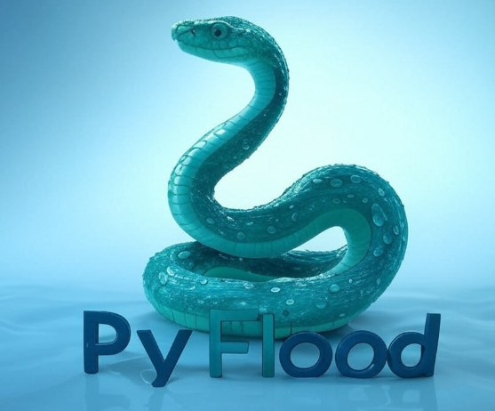

# 

# PyFlood - Advanced DoS Simulation Tool

## Overview
PyFlood is a Python-based tool designed to simulate HTTP flood attacks for **educational purposes** and **ethical hacking** in controlled environments. It helps security professionals and students assess the resilience of web servers and network infrastructure under stress, allowing them to identify vulnerabilities and enhance defenses.

> **Important:** This tool is intended strictly for educational and ethical hacking purposes. Unauthorized use against any system without explicit permission is illegal and unethical. Always ensure you have proper authorization before testing any network or server.

## Table of Contents
- [Disclaimer](#disclaimer)
- [Features](#features)
- [Installation](#installation)
- [Usage](#usage)
- [Proxy File Format](#proxy-file-format)
- [Notes](#notes)
- [License](#license)

---

## Disclaimer
PyFlood is provided for educational purposes only. It is designed to help users understand the mechanics of DoS attacks in a **controlled, ethical environment**. Unauthorized use of this tool to attack or disrupt any system without **explicit permission** is strictly prohibited and may violate local, national, or international laws. The developers assume **no responsibility** for any misuse of this tool.

---

## Features
PyFlood includes several advanced features for simulating **realistic** HTTP flood attacks:

- **Multi-threading:** Simulates multiple concurrent connections to amplify the attack’s impact.
- **Proxy Support:** Uses a list of proxies to anonymize the source of requests, with random rotation.
- **HTTPS Support:** Allows targeting both HTTP and HTTPS servers.
- **Multiple HTTP Methods:** Supports `GET`, `POST`, and `HEAD` requests.
- **Rate Control:** Controls the speed of requests to simulate varying attack intensities.
- **Randomized Headers:** Generates random `User-Agent` and other HTTP headers to evade basic detection.
- **Asynchronous Requests:** Uses `aiohttp` for high-performance, non-blocking requests.
- **Real-Time Monitoring:** Displays live statistics, including requests sent, elapsed time, and request rate.
- **Duration Control:** Optionally limits the simulation to a specified duration.
- **Logging:** Records detailed logs for analysis, including timestamps and response statuses.

---

## Installation

### Prerequisites
- **Python 3.7+**: Ensure Python is installed on your system.
- **Dependencies**: Install the required Python libraries using:

```bash
pip install aiohttp
```

### Setup
1. Clone or download the repository containing the PyFlood script.
2. *(Optional)* Create a `proxies.txt` file with a list of proxies in the format `host:port` (one per line).

---

## Usage
PyFlood is a **command-line tool** with several configurable options.

### Basic Syntax
```bash
python pyflood.py --target <TARGET> [OPTIONS]
```

### Command-Line Arguments

| Argument  | Description | Required | Default |
|-----------|-------------|----------|---------|
| `--target` | Target IP address or domain (e.g., `127.0.0.1` or `example.com`) | Yes | N/A |
| `--port` | Target port | No | `80` |
| `--threads` | Number of concurrent threads (asyncio tasks) | No | `10` |
| `--proxies` | Path to a file containing a list of proxies (`host:port` per line) | No | None |
| `--rate` | Requests per second per thread | No | `100` |
| `--duration` | Duration of the simulation in seconds | No | Unlimited |
| `--method` | HTTP method to use (`GET`, `POST`, `HEAD`) | No | `GET` |
| `--https` | Use HTTPS instead of HTTP | No | HTTP |

### Example Usage

#### Simulate an HTTP GET flood on `127.0.0.1:80` with 5 threads, each sending 50 requests per second for 60 seconds:
```bash
python pyflood.py --target 127.0.0.1 --port 80 --threads 5 --rate 50 --duration 60
```

#### Simulate an HTTPS HEAD flood on `example.com:443` using proxies:
```bash
python pyflood.py --target example.com --port 443 --threads 10 --proxies proxies.txt --rate 100 --method HEAD --https
```

### Permission Prompt
Before starting the simulation, PyFlood prompts you to confirm permission to test the target:

```bash
Do you have permission to test <TARGET>? (yes/no):
```

Typing `yes` proceeds with the test. Any other input aborts the simulation.

---

## Proxy File Format
If using proxies, create a text file (e.g., `proxies.txt`) with one proxy per line in the format:
```
192.168.1.10:8080
10.0.0.1:3128
172.16.0.1:80
```
Proxies are rotated randomly for each request to simulate distributed traffic.

---

## Notes
- **Ethical Use:** Always obtain explicit permission before testing any system. Unauthorized testing is **illegal**.
- **Performance:** The tool uses **asynchronous requests** for high performance. Adjust the number of threads and request rate based on system capacity.
- **Logging:** Logs are saved to `pyflood.log` and displayed in the console for real-time monitoring.
- **HTTPS:** When using `--https`, ensure the target supports HTTPS and the port is correctly set (usually `443`).
- **Stopping the Simulation:** Press `Ctrl+C` to stop the simulation at any time. If a duration is set, it will stop automatically.

---

## License
This project is licensed under the **MIT License**. See the `LICENSE` file for details.

---
